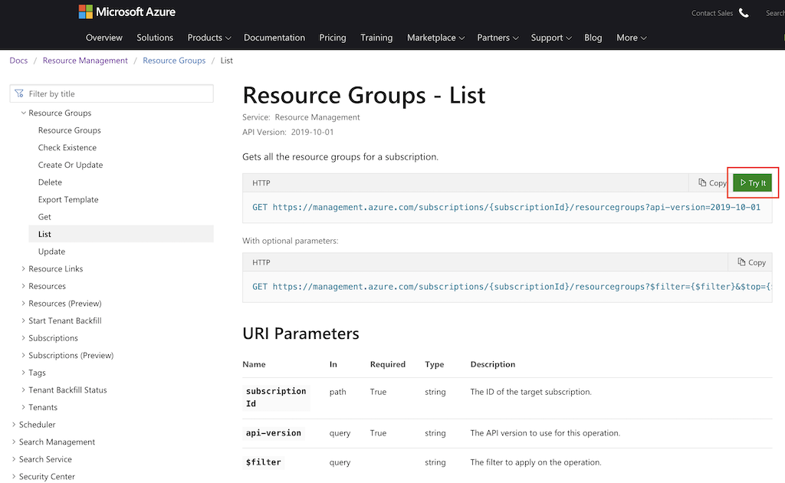
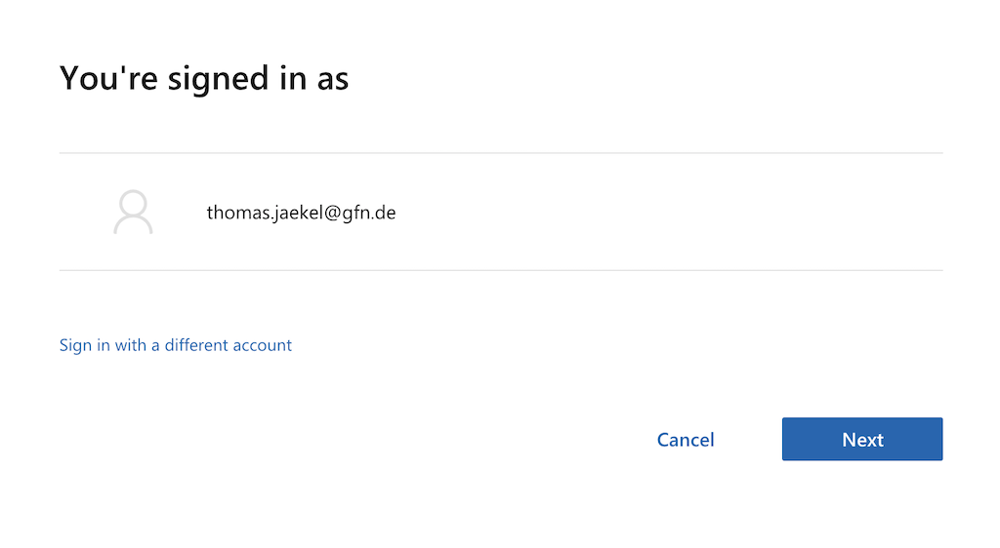

# How to Manage Resource Groups via Azure REST API Browser

There is the Azure REST API Browser:

https://docs.microsoft.com/en-us/rest/api/

Let's manipulate resource groups with the help of Azure REST API Browser.

## Enumerate Resource Groups
[Start here](https://docs.microsoft.com/en-us/rest/api/resources/resourcegroups/list)

Sign in with your Azure account

Compose the request

## Create Resource Group
[Start here](https://docs.microsoft.com/en-us/rest/api/resources/resourcegroups/createorupdate)

## Modify Resource Group
[Start here](https://docs.microsoft.com/en-us/rest/api/resources/resourcegroups/update)

### Delete resouce group
[Start here](https://docs.microsoft.com/en-us/rest/api/resources/resourcegroups/delete)

