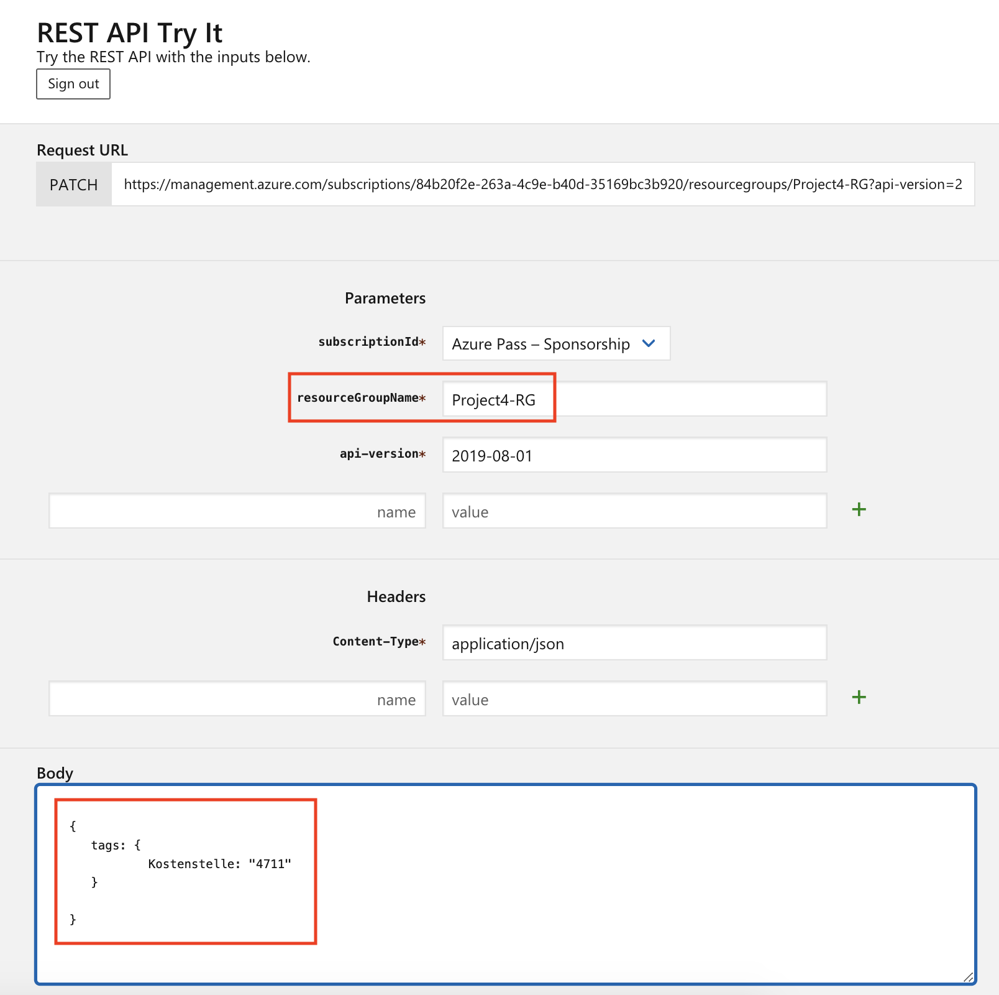

### REST API Browser
https://docs.microsoft.com/en-us/rest/api/

### Enumerate resource groups
https://docs.microsoft.com/en-us/rest/api/resources/resourcegroups/list

### Create resource group
https://docs.microsoft.com/en-us/rest/api/resources/resourcegroups/createorupdate

### Modify resource group
https://docs.microsoft.com/en-us/rest/api/resources/resourcegroups/update

### Delete resouce group
https://docs.microsoft.com/en-us/rest/api/resources/resourcegroups/delete

